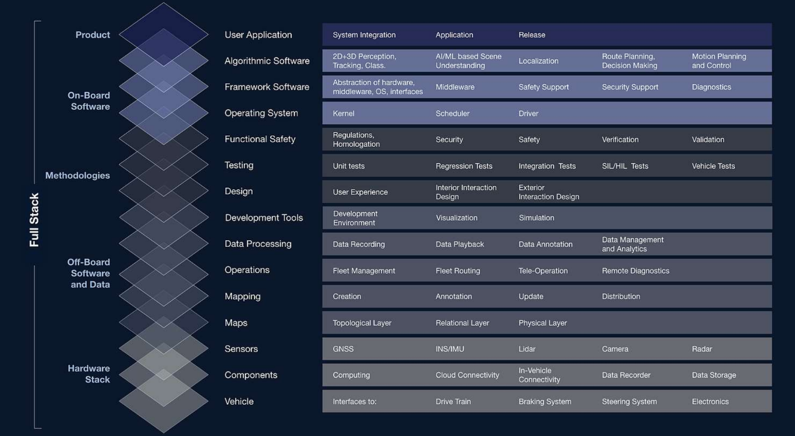
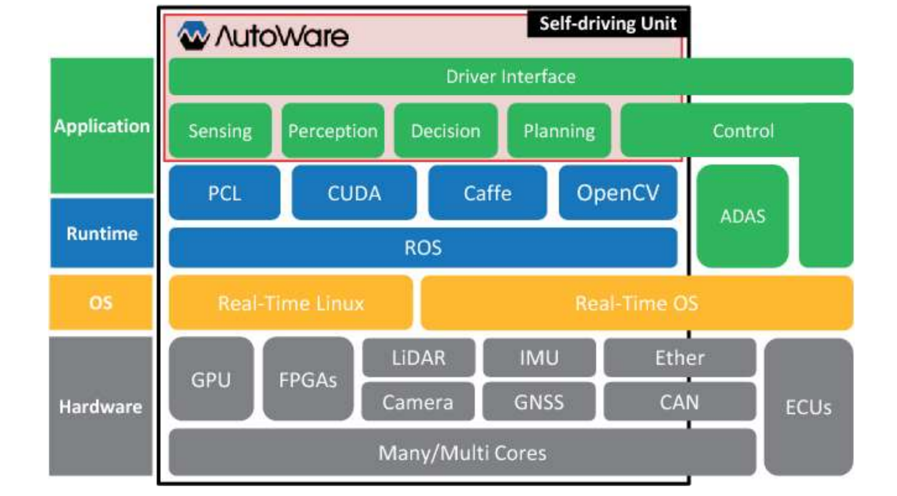
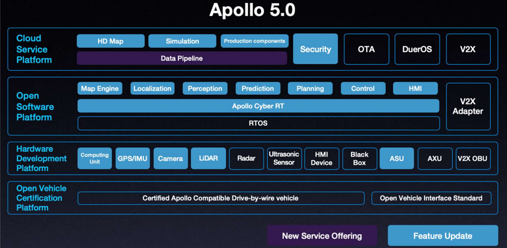
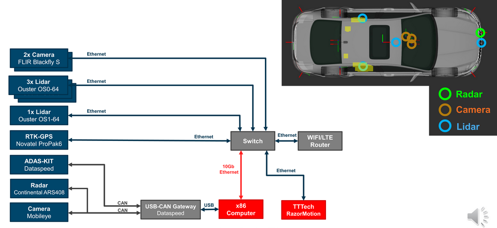

# Lecture 05: Autonomous Driving Stack

This lecture is provided by [Daniel Watzenig](https://www.linkedin.com/in/daniel-watzenig-4a0b985) and by [Markus Schratter](https://www.linkedin.com/in/markusschratter), from Autonomous Stuff. The lecture is available in YouTube:

The lecture will go through the motivation to use Autonomous Driving (AD) Stacks, the architecture of the AD stack based on Autoware, other AD stacks, how to integrate Autoware in research vehicles and an Autoware use case. In general, a view of the AD stacks will be provided. i.e. the required building blocks to create a self-driving car product that is safe to sell. The main concepts of the lecture will be:

- What are the AD stacks.
- Why they are necessary.
- How to use the Autoware-provided AD stack.

The provided PDFs can be found in the Apex.AI's [autowareclass2020 repository](https://gitlab.com/ApexAI/autowareclass2020/-/blob/master/lectures/05_Architectures), in GitLab. There is one for the [first](https://gitlab.com/ApexAI/autowareclass2020/-/blob/master/lectures/05_Architectures/Part_1.pdf), [second](https://gitlab.com/ApexAI/autowareclass2020/-/blob/master/lectures/05_Architectures/Part_2.pdf) and [third](https://gitlab.com/ApexAI/autowareclass2020/-/blob/master/lectures/05_Architectures/Part_3.pdf) parts of the lecture. The first part will go through AD stacks, the second will be about why and how to integrate Autoware in a research vehile and the third will analyze an Autoware use case. The PDFs are included in the *resources* folder of this directory.

---

## First part
## [5.1. Autonomous Driving Stacks](https://youtu.be/nTI4fnn2tuU?t=45)
During this first part, the hihg level architecture of Autonomous Vehicles (AVs) will be introduced, as well as the signal flow and timing requirements. The control layer will be seen on more depth, as well as the difference between concepts such as *safety critical*, *mission critical*, *load critical* and *mixed critical* systems.

### [5.1.1. Architecture of AD Stack](https://youtu.be/nTI4fnn2tuU?t=45)
The AD stack consist in several layers that can be grouped in the *sub-stacks* represented by the following picture (extracted from the official lecture resources):

Focusing in a higher-level Autonomous Vehicle (AV) architecture and needs, a lot of **unpredictable conditions** will be faced (accidents, extreme weather conditions, humans or animals appearing in the road, etc.). They make it necessary to **fuse data** from a lot of sensors (RADARs, LIDARs, cameras, infrarred, ultrasonic, etc.) aund use a reliable sensor data processing and fusion to deliver a consistent model of the environment. This will allow the system to **plan safe actions** given the current conditions planning high-level behaviors as well as which trajectories and maneuvers are needed to actually execute them. Finally, a **low-level control** of the actuators is needed to perform all the necessary individual actions (braking, steering, throttle, etc.) to follow the planned trajectory. An additional module to all this is the **system performance and driver monitoring**, which will also provide valuable information, specially to prevent fatal failures or, at least, make their consequences less severe.

### [5.1.2. Signal Flow and Block Interaction](https://youtu.be/nTI4fnn2tuU?t=485)
Assuming as the basic blocks or layer the sensors, the perception, the planning and the control, the signal high-level interaction between them will be the perception one using the data from the sensors to perform detection, classification and tracking of relavant objects or spaces, as well as to localize the car, which will be done using the map aswell. All the generated information (where are the lanes, traffic signs, objects in the road and close to it, etc.)) is forwarded to the planning block, which will have planned (*long-term*) route, will predict the behavior of the other detected objects, plan the behavior that the ego-car should have and generate a trajectory that implements that behavior safely. Finally, the control layer will control the actuators to perform this trajectory.

### [5.1.3. Control Layer and AD Stack Task Decomposition](https://youtu.be/nTI4fnn2tuU?t=645)
The **control layer** perform different tasks that can be divided in the following **levels**:
- **Strategic/Mission Level**: The highest level task, consisting in route planning. The vehicle must follow existing roads and comply with the driving laws. It is allowed to take more than 10 seconds for it to do its job.
- **Tactical level**: It is in charge of maneuverin the vehicle in traffic. i.e. following a lane, mergin into a different one, execute the responses to the events that come up, etc. These tasks may have deadlines going from 1 second up to 10.
- **Reactive/Operational Level**: The control level with the shortest deadlines. It is in charge of controlling the the lateral and logitudinal adjustments of the vehicle's position in time frames going from 0.01 seconds up to 0.1.
- **Active Safety**: It runs in parallel and is in charge of reacting to threats. Some of the functions it may implement are the automated emergency braking or emergency maneuvers. Its actions can take from 0.1 seconds to 15.

The components of the AD stack in general can be assigned one of the following **levels of criticality**:

- **Safety-critical**: The highest and most important criticality level. When a safety-critical application or system fails, its consequence could be damage or death of the passengers. An example would be the controller of the steering angle. Safety-critical parts of the system must run in hard Real Time (RT).
- **Mission-critical**: They have a high priority, but their failure will not harm humans. A failure in it, will mean that the mission will not succeed. An example is the navigation system. If it does not work, the passengers will not reach their destination. It should work in soft RT.
- **Low-critical**: Tasks that do not affect the mission or safety, but affect the user experience.

A system integrating components with different levels of criticality in the same hardware platfom is known as a  **Mixed Criticality Systems** (MCS). AVs or UAVs are usually examples of this type of systems.

### [5.1.4. Autoware](https://youtu.be/nTI4fnn2tuU?t=950)
So far, the discuted topics were the motivation of AD stacks, the layers composing the full stack (HW layer, off-board layer, on-board layer and methods and tools implementing the stack),  the high-level architecture of an AV and the signal flow withing the building blocks of it (sense, plan and act), the layers within the control block (strategic, tactical and reactive) and the levels of criticality (safety, mission and low critical apps and systems). Next, the Autoware AD stack will be introduced, as well as its abstraction layers and the differences between Autoware.AI and Autoware.Auto.

Autoware was started in 2015 by Shinpei Kato at Nagoya University as an open-source software for AD. The Autoware Foundation was created in 2018, which is a non-profit organization supporting Autoware, composed by many partners from the industry, government and academic ambits.

#### [5.1.4.1. Autoware.AI](https://youtu.be/nTI4fnn2tuU?t=1095)
It was the first project and it was based on ROS 1. It is under the Apache 2.0 license and contains the following modules:

- **Localization** using 3D maps and SLAM algorithms combined with GNSS and Inertial Movement Units (IMUs).
- **Detection** using cameras and LiDARs, sensor fusion and Deep Neural Networks (DNNs).
- **Prediction and planning** based on rule-based probabilistic system, with some DNNs as well.

Autoware's output was a *twist* message, contanining linear and angular velocities.

Regarding its **abstraction layers**, in Autoware.AI they are:

- **Hardware layer**: It includes the sensors and communication and computational resources, as listed in the image below (extracted from the official course materials).
- **OS layer**: Running just on top of the hardware. It is distinguished between RT Linux and RTOS.
- **Runtime layer**: All the runtime dependencies of the applications above the OS, such as libraries and *meta-systems* (as ROS).
- **Application layer**: The actual modules implemented using all the layers below this one. The driver interface will be on top of all the other applications. 

#### [5.1.4.1. Autoware.Auto](https://youtu.be/nTI4fnn2tuU?t=1380)
As exposed before in the lecture, hard RT functionalities are required for some parts of the stack. This is the main reason of the evolution of the project towards Autoware.Auto, which uses ROS 2, being this the main difference between these two Autoware versions. Moreover, Autoware.Auto is more modular and its development uses state-of-the-art certifiable development process based on Continous Integration (CI) and Continuous Development (CD), for which the pull requests are reviewed, built and tested, the documentation is comprehensive, 100% of the code is tested, there is a coding guide and is managed by an open source community manager. Further details can be found the provided [Contributor's guide](https://autowarefoundation.gitlab.io/autoware.auto/AutowareAuto/contributors-guide.html).

The **Autoware.Auto development process** is based in Operational Design Domain (ODD), which consists in a series of limitations to the application where the vehicle will be used that are being enlarged whenever the behavior is successful with the current constraints, making them less and less restrictives. Some example constraints could be only day driving, low speeds, absence of other cars, absence of unpredicted events, etc.

#### [5.1.4.3. Commercial use of Autoware](https://youtu.be/nTI4fnn2tuU?t=1735)
Apex.AI is working to achieve the commercial usage of Autoware building on top of Autoware.Auto, developing *Apex.OS*, which improves the code quality, hard RT, safety, documentation, support for automotive ECUs and sensors, certifications (ISO 26262, SEooC, ASIL-D), customer support, etc.

### [5.1.5. Other AD Stacks](https://youtu.be/nTI4fnn2tuU?t=1860)
Appart of the Autoware AD stack, the most popular ones in June 2020 are:

- DriveWorks, by Nvidia.
- Apollo, by Apollo.
- EB Robinos and EB Robinos Predictor, by Elektrobit.

#### [5.1.5.1. Nvidia DriveWorks](https://youtu.be/nTI4fnn2tuU?t=1965)
The main difference with Autoware is that the Nvidia stack is not open-source. It is composed by the following blocks:

- **Drive AV**: Planning, mapping and perception.
- **Drive IX**: Visualization, AI CoPilot and AI Assistant. It is sharing the top of the stack with the Drive AV.
- **DriveWorks**: Supports networks, calibration (link to the vehicle) and core (bottom layer, receiving the sensors inputs, vehicle I/O, etc.).
- **Drive OS**: Lowest level of the stack.
- Supported **hardware** platforms: Nvidia supports the Drive AGX Developer Kits (Xavier/Pegasus) and the Drive Hyperion Developer Kit. Pegasus is currently the best option.

Further details can be found in [Nvidia web](https://developer.nvidia.com/drive/drive-software).

Nvidia offers the **DRIVE Constellation Simulator and the DRIVE Constellation Vehicle**.

The first one uses the so called software world, which is a world with a simulated environment and models for the traffic, the ego vehicle, the sensors and the scenarios. All of this is integrated in the DRIVE Sim API, which runs on top of the DRIVE Sim, which will be running on the DRIVE Constellation OS, using the DRIVE Constellation Simulator as its hardware.

Regarding the DRIVE Constellation Vehicle, it is used when the design, implementation, optimization and testing has already been performed in the Simulator. On top of the hardware, the DRIVE OS is running, used to provide the DRIVE Core and DRIVE Networks. On top of it, as seen before, DRIVE AV and DRIVE IX will be running.

#### [5.1.5.2. Apollo](https://youtu.be/nTI4fnn2tuU?t=2255)
Launched in 2017 and improved since then with over 2-3 updates per year, being the next big update planned for 2021. AVs driven by Apollo are allowed to drive in certain places in public japanese roads. It has a lot of partners/supporters.

The Apollo modules are quite similar to both the Autoware and Nvidia ones, being the following:

- Data pipeline
- Perception
- Planning
- Control
- Prediction
- Map engine
- Simulation

The current Apollo 5.0 supports four layers: Open Vehicle Certification Platform, Hardware Development Platform, Open Software Platform and Cloud Service Platform, being each of them composed by the elements shown in this image, extracted from the official course materials:

---

## Second part
## [5.2. Autoware.AI Integration in a Research Vehicle](https://youtu.be/nTI4fnn2tuU?t=2465)
This section will cover the Autoware installation, the hardware components of the vehicle, the software requirements and a demonstration of the mapping process of Autoware.AI. The modules of Autoware.AI can be found in its [GitLab](https://gitlab.com/autowarefoundation/autoware.ai), being the main ones the [core_perception](https://gitlab.com/autowarefoundation/autoware.ai/core_perception), [core_planning](https://gitlab.com/autowarefoundation/autoware.ai/core_planning) and [simulation](https://gitlab.com/autowarefoundation/autoware.ai/simulation) ones. Autoware.AI is scheduled to go into maintenance mode at the end of 2020 and its end-of-life will be at the end of 2022.

### [5.2.1. Autoware.AI Installation](https://youtu.be/nTI4fnn2tuU?t=2610)
Even the requirements will depend a lot on which stack components are used, the general recommended system specifications are:

- 8 CPU cores
- Nvidia GPU
- 32 GB RAM
- 64 GB storage

It can run on a virtual machine and the installation can be done by a source build or with docker, which is the recommended option. The installation steps are detailed [here](https://gitlab.com/autowarefoundation/autoware.ai/autoware).

### [5.2.2. Hardware Example: Ford Fusion](https://youtu.be/nTI4fnn2tuU?t=2705)
Autoware was integrated in a research vehicle to evaluate the capabilities of this software. They started setting up the hardware and simulation and then kept on going with the mapping, localization, object detection (all these 3 with LiDAR), HD mapping and navigation and planning, respectively.

The used Ford Fusion was only modified to be able to steer, brake and throttle electronically. A 64 layers LiDAR was also added on top of the car and a normal x86 computer was used as the computing platform. An automotive computing platform from [TTTech](https://www.tttech.com/) was also used. Network components, a high-precission IMU and an RTK GPS system are also integrated. In the current version of the car, the sensors augmented to the one represented in the following diagram (extracted from the official materials):

There are two full HD front cameras providing normal images, the 4 LiDARs have a 90º field of view and 360º rotation. The ones on the sides allow detections in death angles for the other ones. Obviously, the one in the front provides a lower point of view that scapes from the rest of them. The two RTK GPS antennas provide a very precise GPS localization (less than 5cm error). The ADAS-KIT allows the vehicle control (throttle, steer and brake). The radar on the front is specially usefur for motorway driving. There is another camera, but this one provides directly object data instead of images (cars, pedestrians, lane marks, traffic signs, etc). These last 3 components use the CAN protocol, while the rest of them uses Ethernet.

### [5.2.3. Autoware's software components](https://youtu.be/nTI4fnn2tuU?t=3095)
Regardless if the car is being simulated or a real one is being used, these will be the software components Autoware makes available:

- **Vehicle Interface** (if using a real vehicle): Through the node `dbw_node`.
- **LiDAR Mapping**: Through the node `ndt_mapping`.
- **LiDAR Localization**: Through the node `ndt_matching`.
- **LiDAR Object Detection**: Through the nodes `euclidean_cluster and `ukf_tracker`.
- **Campus Mapping**: Through the Tier IV's *Vector Mapper*.
- **Waypoint Follower**: Through the Vector Zero's *Road Runner* and the nodes `pure_pursuit` and `mpc_follower`.
- **Global Planner**: Through the node `gloabl_planner`.
- **Local Planner**: Through the nodes `local_planner`, `freespace_planner` and `open_planer`.

Regarding the **localization**, it is required to place the car in the HD Map (go-to technique for navigation in AVs). GPS is an option but it usually introduced too much error (specially when sourrounded by, for example, skyscrapers). Autoware offers a Normal Distributions Transform (NDT) matching, based on LiDAR measurement. Given the huge ammount of data a sensor like this can provide (e.g. 64 layers of points at 20 Hz) and the high computational requirements of the algorithm, the usage of ~1 meter big voxel grids is recommended. This component is implemented [here](https://gitlab.com/autowarefoundation/autoware.auto/AutowareAuto/-/tree/master/src/localization). This algorithm tries to register the currently perceived point cloud with a pre-recorded one (map) to estimate the sensor's (and, therefore, the car's) position.

The **object detection and tracking** allows to avoid collisions and decide the ego car's behavior. Autoware provides several algorithms for these purposes both for camera and LiDAR data. A typical sample LiDAR data processing pipeline would be take the raw measurements, remove the one corresponding to the ground, generate clusters from the pointcloud and track each of the clusters. Instead of being tracked, they can be processed to be classified. More information in the [perception folder](https://gitlab.com/autowarefoundation/autoware.auto/AutowareAuto/-/tree/master/src/perception) of the GitLab repository.

The **planning** has more hierarchy levels. It starts with the route planning (the global route to be followed to go from the point A to the point B, e.g. going from Vienna to Berlin). Next, the motion planning considers the local obstacles, required speed variations, driving rules, etc. Autoware implements *Open Planner*, *Lane Planner* and *A Star* for this last purpose. These tools can be found in the [motion/planning](https://gitlab.com/autowarefoundation/autoware.auto/AutowareAuto/-/tree/master/src/motion/planning), [motion/control](https://gitlab.com/autowarefoundation/autoware.auto/AutowareAuto/-/tree/master/src/motion/control) and [external](https://gitlab.com/autowarefoundation/autoware.auto/AutowareAuto/-/tree/master/src/external) folders of the GitLab.

Finally, **mapping** is used with two purposes: 1) mapping for localization (withour RTK-GPS), that matches 64 layer LiDAR measurements with NDT to provide a pointcloud of the environment, and 2) HD map for path planning, which is built using a [browser-based tool](https://tools.tier4.jp/feature/vector_map_builder/) for mapping by Tier IV, which uses Lanelet2 and Vectop Map data.

---

## Third part
## [5.3. Use Cases](https://youtu.be/nTI4fnn2tuU?t=3720)
### [5.3.1. Autoware Usage in Academical Research](https://youtu.be/nTI4fnn2tuU?t=3750)
AD is not an easy task because it requires all the layers of the AD stack (perception, localization, high and low level planning, control, etc.) to be implemented and integrated, as well as complex modifications to the vehicle to be used. It also requires a lot of other side components such as calibration, monitoring, fault detection, etc.

In the academical research context, developing a whole AV is even harder because the purpose of the research groups are usually make small advancements in particular areas, not to build a fully functional AV, as could be the target of the research division of an industrial company. However, for academical research, it is still almost essential in many cases to **have the full AD stack running** to test and evaluate their work. This can be achieved by using Autoware, which provides components of the full stack.

The availability of **simulation environments** is also key. Gazebo, LGSVL and CARLA provide interfaces for Autoware and allow researchers to test their ideas before trying in a real vehicle or even remove the need of using a real platform. Additional advantages of these simulators are that they are open source and the big community they have.

It is helpful to **introduce students** smoothly in complex topics abstracting parts that they do not need to know about yet.

### [5.3.2. Autoware Usage in a PhD Thesis](https://youtu.be/nTI4fnn2tuU?t=4090)
The example thesis is about critical situations with pedestrians when using AVs. It implements a collision avoidance system for extreme unpredicted situations, such as a pedestrian jumping from behind a parked car or when the object prediction module fails. It gets as inputs the traffic participants, the HD map and the trajectory from the AD stack. The output will be an emergency intervention (if needed) that may consist in brakin, a maneuver, etc.

Using Autoware instead of vanilla ROS made it easier to integrate the project in a real vehicle. The used Autoware components were the mapping (point cloud and HD maps), the localization (LiDAR-based and EKF localizer), the mission/gloabl planner and the motion planning (lane planner and open planner).

### [5.3.3. Autoware Usage in an Autonomous Racing Car](https://youtu.be/nTI4fnn2tuU?t=4860)
The final usecase is about autonomous racing. In particular, the [Autonomous Racig Graz](https://autonomousracing.ai/) team of the Roborace. So far, they participated in a LiDAR localization challenge and a regular race.

Regarding the **LiDAR-based localization**, the usage of Autoware was chosen because of the experience the team already had in the usage of Autoware's NDT. Moreover, it served as a *test* for further usages at higher speeds and it is a reliable and robust method. NDT was used for both the localization and the track point cloud mapping. The pointcloud made it easy to recognise the curves and overall circuit, so it could be used to draw the optimal racing line (which was done using this [TUM tool](https://github.com/TUMFTM/global_racetrajectory_optimization).

As non-Autoware related additional notes, for this application, the LiDAR measurements were filtered using a voxel grid to enlight the computation and the measurement distortions were corrected according to how the car is being driven. This is done by storing a the time stamp when each point was measured, given that, specially at high speeds, by the time the LiDAR finishes one scan, the car may have advanced a relevant distance. This needs to be taken into account in order to achieve good precision levels when it comes to localization. Further details on this will be published in the IEEE International Instrumentation and Measurement Technology Conference of 2020, in the *Increased Accuracy For Fast Moving LiDARS: Correction of Distorted Point Clouds* paper.

For reference, NDT achieved errors that were most of the time below 20 cm, being over 10 most of the time. This metric was obtained using the high-precission GPS localization as the ground truth. The CPU mode of NDT was used and high CPU loads were detected when driving at accelerations of more than 1g.

