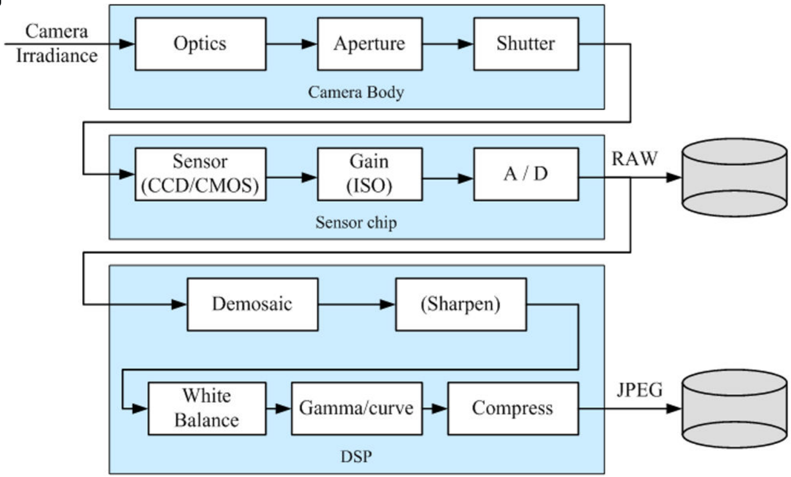

# Lecture 08: Camera-Based Object Perception

This lecture is provided by [Michael REKE](https://www.linkedin.com/in/michael-reke-54a90589/), [Stefan SCHIFFER](https://www.linkedin.com/in/stefanschiffer/) and [Alexander FERREIN](https://dblp.uni-trier.de/pers/f/Ferrein:Alexander.html) and GjorgJi NIKOLOVSKI, from the [FH AAchen University](https://www.fh-aachen.de/en). The lecture is available in YouTube:

The lecture will cover how to use 2D camera data to detect objects in real scenarios. In particular, it will go through detecting lanes, vehicles and pedestrians with neural networks and the toolboxes that may be used for those purposes. Also, a lane detection node in ROS 2 will be created.

The provided slides in PDF and notes about the lab of the lecture can be found in the Apex.AI's [autowareclass2020 repository](https://gitlab.com/ApexAI/autowareclass2020/-/blob/master/lectures/08_Perception_Camera), in GitLab. The slides in PDF and the lab notes in MarkDown are included in the *resources* folder of this directory. The code used in the lecture video is available [here](https://gitlab.com/ApexAI/autowareclass2020/-/tree/master/code/src/08_Perception_Camera).

## [8.1. Camera Basics](https://youtu.be/OtjTa-meJ-E?t=105)
### 8.1.1. Image Formation and Basic Camera Model (00:02:05)
The images are created because a sensor plane receives light that surfaces reflect from a certain light source. Before reaching the sensor plane, the ligh goes through some optics, which could go from a hole in a box (Pinhole camera) to a complex set of optical focal lenses to filter and/or distort the light in several ways.

When using a thin focal length with focal *f* separated a distance *z_0* from an object that is being projected and *z_i* from the sensor plane, the relation *1/z_0 + 1/z_i = 1/f* will be true. When the distance between the lens and the sensor plane is not exactly *f*, blurr will appear, which can be quantified by the diameter of the *circle of confusion* (*C*), which is also known as the *Depth of Field* (*DoF*), which depends on the focal length *f* and the aperture *d* (size) of the lens. The smaller the aperture is, the bigger the DoF will be and the less blurred the objects far away from the camera will be seen. The *Field of View* (FoV) Will be defined by the sensor size (*W*) and its distance towards the lens (*z_i*), so *FoV = W/z_i*.

To project a 3D point into the 2D image plane, the **intrinsic camera parameters** are used, which are usually represented in a matrix named *K*, containing the focal length in the X and Y axis in the two first components of the main matrix diagonal, the *skew* (a measure of how much the sensor plane is inclined with respect to the lens) and the image center in X and Y axis. When using several cameras (or if we want the camera coordinates to be in our world frame), the extrinsic parameters will also be necessary, which are represented in an homogeneous transformation matrix containing a rotation *R* and a traslation *t*.

### 8.1.2. Digital Cameras (00:06:00)
They capture images and load them into digital memory. There are two main sensor types with this purpose: Charged Coupled Devices (CCDs) and Complementary MOSs (CMOSs). Both of them basically counts how many photons goes through a region of space (pixel) in a certain ammount of time, providing an intensity image (the more photons, the more intense the pixel will be). The color can be achieved by using three sensors and routing the light filtered so that only red, green or blue light will reach each of them or sharing one sensor but filtering the light so each pixel will receive red, green or blue color with a certain pattern. In the following image, the full imaging pipeline for digital cameras is shown:

### 8.1.3. Color Spaces (00:07:30)
The RGB patterns on color filters for digital cameras are designed keeping the human response to colors (cone cells), which are analyzed in the *Long, Medium, Short* (LMS) color space. The CIE 1931 XYZ color space was the first one relating the electromagnetic color wavelengths with the human-perceived physical colors.

Other more popular color spaces for digital imaging is the **RGB**, which is a 3D cube. It is used for light sources, such as screens. It is based in an additive color model.

The **YUV** one was developed for analog PAL/NTSC, while **YCbCr** is focused on digital applications. They separate intensity (Luminance) from color (Chrominance, U and V or Cb and Cr). Its main advantage is that band width could be saved by using higher resolution for the intensity and lower one for the color. It is also useful in computer vision for stablishing more robust color-based thresholds.

In the same fashion as the last ones, **HSV** separates the color (Hue) from the Saturation and the intensity (Value). It is very used to reproduce color samples and is very useful in computer vision aswell.

### 8.1.4. Lens Distortion (00:11:10)
It is introduced when lenses are used but, since they are systematic error, all these distortions can be calibrated and removed from the images (if desired). There are three types of distorsion: barrel, pincushion and mustache.

## 8.2. Camera Calibration (00:11:55)
### 8.2.1. Installing the Camera System
### 8.2.2. Calibration Procedure - The Chessboard Pattern
### 8.2.3. Calculation of Intrinsic and Extrinsic Parameters

## 8.3. Neural Networks for Camera-Based Object Detection
### 8.3.1. Neural Networks Basics
### 8.3.2. Examples of DNNs
- YOLO
- ...
### 8.3.3. Available data sets
- KITTI
- Ford
- ...
### 8.3.4. Computation Problem
- Real-Time

## 8.4. Available Toolboxes
### 8.4.1. OpenCV: Basic Algorithm Toolbox
### 8.4.2. CUDA: GPU Deployment Toolbox
### 8.4.3. Higher Level Integrated Toolboxes
- NVIDIA AD Toolbox

## 8.5. Use Case: Lane Detection
### 8.5.1. Lane Detection Basics
### 8.5.2. Polynomial Lane-Fitting for Data Reduction
### 8.5.3. Step-by-Step Hands-on

## 8.6. Lab: Lane Detection with Real Data
- Readin Data from a Data Stream
- Calculate Real World Coordinates of the Lanes
- Polynomial Fitting of Detected Lanes
- Generating ROS 2 Messages
- Visualizatoin
  - RViz 2

