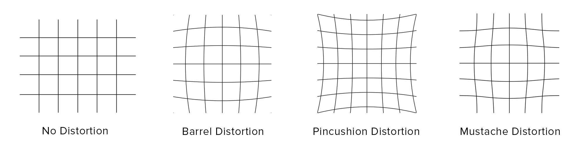

# Lecture 08: Camera-Based Object Perception

This lecture is provided by [Michael REKE](https://www.linkedin.com/in/michael-reke-54a90589/), [Stefan SCHIFFER](https://www.linkedin.com/in/stefanschiffer/) and [Alexander FERREIN](https://dblp.uni-trier.de/pers/f/Ferrein:Alexander.html) and GjorgJi NIKOLOVSKI, from the [FH AAchen University](https://www.fh-aachen.de/en). The lecture is available in YouTube:

The lecture will cover how to use 2D camera data to detect objects in real scenarios. In particular, it will go through detecting lanes, vehicles and pedestrians with neural networks and the toolboxes that may be used for those purposes. Also, a lane detection node in ROS 2 will be created.

The provided slides in PDF and notes about the lab of the lecture can be found in the Apex.AI's [autowareclass2020 repository](https://gitlab.com/ApexAI/autowareclass2020/-/blob/master/lectures/08_Perception_Camera), in GitLab. The slides in PDF and the lab notes in MarkDown are included in the *resources* folder of this directory. The code used in the lecture video is available [here](https://gitlab.com/ApexAI/autowareclass2020/-/tree/master/code/src/08_Perception_Camera).

## [8.1. Camera Basics](https://youtu.be/OtjTa-meJ-E?t=105)
### [8.1.1. Image Formation and Basic Camera Model (00:02:05)](https://youtu.be/OtjTa-meJ-E?si=C83_LYac5lDCIkM6&t=125)
The images are created because a sensor plane receives light that surfaces reflect from a certain light source. Before reaching the sensor plane, the ligh goes through some optics, which could go from a hole in a box (Pinhole camera) to a complex set of optical focal lenses to filter and/or distort the light in several ways.

When using a thin focal length with focal *f* separated a distance *z_0* from an object that is being projected and *z_i* from the sensor plane, the relation *1/z_0 + 1/z_i = 1/f* will be true. When the distance between the lens and the sensor plane is not exactly *f*, blurr will appear, which can be quantified by the diameter of the *circle of confusion* (*C*), which is also known as the *Depth of Field* (*DoF*), which depends on the focal length *f* and the aperture *d* (size) of the lens. The smaller the aperture is, the bigger the DoF will be and the less blurred the objects far away from the camera will be seen. The *Field of View* (FoV) Will be defined by the sensor size (*W*) and its distance towards the lens (*z_i*), so *FoV = W/z_i*.

To project a 3D point into the 2D image plane, the **intrinsic camera parameters** are used, which are usually represented in a matrix named *K*, containing the focal length in the X and Y axis in the two first components of the main matrix diagonal, the *skew* (a measure of how much the sensor plane is inclined with respect to the lens) and the image center in X and Y axis. When using several cameras (or if we want the camera coordinates to be in our world coordinates system), the extrinsic parameters will also be necessary, which are represented in an homogeneous transformation matrix containing a rotation *R* and a traslation *t* amongst both cameras.

### [8.1.2. Digital Cameras (00:06:00)](https://youtu.be/OtjTa-meJ-E?si=43P7cxtsxTtUyKiv&t=360)
They capture images and load them into digital memory. There are two main sensor types with this purpose: Charged Coupled Devices (CCDs) and Complementary MOSs (CMOSs). Both of them basically counts how many photons goes through a region of space (pixel) in a certain ammount of time, providing an intensity image (the more photons, the more bright the pixel will be). The color can be achieved by using three sensors and routing the light filtered so that only red, green or blue light will reach each of them or sharing one sensor but filtering the light so each pixel will receive red, green or blue color with a certain pattern (bayer pattern), which would require a *demosaicing* step. We may apply filters to sharpen the image, perform white balance and gamma correction, etc. In the following image, the full imaging pipeline for digital cameras is shown:

### [8.1.3. Color Spaces (00:07:30)](https://youtu.be/OtjTa-meJ-E?si=e66lAGko76Wjte84&t=450)
The RGB patterns on color filters for digital cameras are designed keeping the human response to colors (cone cells), which are analyzed in the *Long, Medium, Short* (LMS) color space. The CIE 1931 XYZ color space was the first one relating the electromagnetic color wavelengths with the human-perceived physical colors.

Other more popular color spaces for digital imaging is the **RGB**, which is a 3D cube. It is used for light sources, such as screens. It is based in an additive color model, so black corresponds to [0, 0, 0] and white to (255, 255, 255), assuming 255 is the maximum value for all channels. Its substractive counterpart is **CMY** (Cyan, Magenta and Yellow), whose white is in [0, 0, 0], and it's commonly used for printed media.

The **YUV** one was developed for analog PAL/NTSC, while **YCbCr** is focused on digital applications. They separate intensity (Luminance) from color (Chrominance, U and V or Cb and Cr). Its main advantage is that band width could be saved by using higher resolution for the intensity and lower one for the color. It is also useful in computer vision for stablishing more robust color-based thresholds. It is very easy to use **chroma subsampling** to save space, which means use more bytes to store the luminance than the ones used to store the colors, since humans are way better at telling if something is brighter/darker than if something is slightly more or less of any color. YUV444 uses one byte per pixel per channel, so 3 bytes/pixel, YUV422 uses 2 bytes/pixel (4 bytes for 2 pixels), YUV411 uses 1.5 bytes/pixel (6 bytes for 4 pixels).

In the same fashion as the last ones, **HSV** separates the color (Hue) from the Saturation and the intensity (Value). It is very used to reproduce color samples and is very useful in computer vision aswell. It defines a conic color space.

### [8.1.4. Lens Distortion (00:11:10)](https://youtu.be/OtjTa-meJ-E?si=BiY84eiNlie4lmIS&t=670)
It is introduced when lenses are used but, since they are systematic error, all these distortions can be calibrated and removed from the images (if desired). There are three types of distorsion: barrel, pincushion and mustache:

## [8.2. Camera Calibration (00:11:55)](https://youtu.be/OtjTa-meJ-E?si=5_gVEmLUqzIW-rr9&t=715)
Calibrating a camera or a set of them will provide us with the intrinsic and extrinsic parameters, allowing us to know how 3D points are projected into the images our system si recieving, allowing us to know where the image points are relative to the vehicle.

### [8.2.1. Goal of the Calibration (00:13:15)](https://youtu.be/OtjTa-meJ-E?si=Ei_WPyPAjGaGgPo_&t=795)
An useful application of having a calibrated monocular camera in an Autonomous Vehicle (AV) is the ability to get a bird's eye view of the road and other traffic participants (which would be projected in the flat groundplane). It is possible to use the intrinsic and extrinsic parameters to warp the image and get this top-down perspective of the road using just a picture taken from the front part of the ego-vehicle. Some applications of this bird's eye view are:

- Gather road information, such as painted traffic signs or different types of lane lines.
- Estimating the position of the ego vehicle in the current lane.
- Estimate the ego car's position relative to other cars or lanes (without a real scale, though).

### [8.2.2. Calibration Procedure (00:17:05)](https://youtu.be/OtjTa-meJ-E?si=CPvjoKsb9Vxn17sS&t=1025)
The Z. Zhang's principle consists in using a checkboard pattern to detect the corners between the black and white squares (which is very easy due to the very high contrast) in a set of pictures containing different scales, vertical and horizontal positions and angles between the pattern and the camera. Since the cell size will be known, the corner detections can be used to know how does the camera deforms the real pattern, which is used to compute the intrinsic parameters (focal length, skew and image center) and distortion coefficients (usually radial and tangential). The Matlab/Simulink toolbox, as well as the OpenCV library and many others toolboxes provides ways of doing this.

After having the intrinsic parameters and the distortion coefficients, we can undistort the images and proceed with the calibration of the extrinsic paramters. Assuming that we want to transform the image to a top-down perspective, we will lay the pattern in the floor and will get the rotation and traslation needed to get this new chessboard position. It is also possible to set the chessboard at a known angle of the ground (e.g. 90º) and add this angle to the obtained transformation later. This last approach will make it easier to detect the corners.

### [8.2.3. Using the Calibration (00:24:05)](https://youtu.be/OtjTa-meJ-E?si=foRbUBaTK48NdBW4&t=1445)
Even we have all the necessary data to transform images in brid's eye view, this operation is very computationally expensive, specially if we want to do this with every frame of a video. This is why what is usually done is detecting objects in the untransformed image, getting bounding boxes (BBs) of the Regions of Interest (RoIs) and only transforming these pixels.

Other things to keep in mind when using this technique is the wobbling of the car (while braking or accelerating), blurrness at high speeds or hilly roads. For all these situations, the extrinsic parameters must be adapted to achieve precise results, using an IMU for example.

## [8.3. Neural Networks for Camera-Based Object Detection (00:27:20)](https://youtu.be/OtjTa-meJ-E?si=OgeAnp05ykllqQe7&t=1640)
This section will give an overview of image segmentation, convolution kernels, edges and features, neural networks

### [8.3.1. Image Segmentation (00:28:96)](https://youtu.be/OtjTa-meJ-E?si=Lx_KlSZy_larfklo&t=1686)
It consist about simplifying an image so that it's easier to analyze by partitioning it into segments (groups of pixels). We will be looking at thresholding and clustering, but there are more methods.
  - **Thresholding**: We can apply a binary threshold so that every pixel of an image below an intensity threshold will be 0 and every pixel above it will become a certain maximum value.
  - **Clustering**: If using **k-means**, we would pick a number of clusters (randomly or with some criteria). Each pixel will be assigned to the cluster to which it has the smallest distance. Then, the cluster centers would be recomputed to be closer to the center of each cluster, the pixels are re-assigned, and the process is repeated a few times or until no pixels change clusters.

### [8.3.2. Convolution Kernels, edges and features (00:31:17)](https://youtu.be/OtjTa-meJ-E?si=RcXK9SQI2Utq80Ds&t=1877)
We can use convolution kernels as filters to perform different operations in the image, such as smoothing, sharpening, extract edges, etc. An example of it is the [**Canny edge detection**](https://www.youtube.com/watch?v=sRFM5IEqR2w), which consists in:
  - Reducing the image noise by slightly blurring it.
  - Finding the intensity gradient of the image (until here it is the same as using a [**Sobel edge detection**](https://www.youtube.com/watch?v=uihBwtPIBxM)).
  - Perform a non-maximum suppression (keep only edges with bigger magnitude than the neighbours with the same orientation) to make edges 1-pixel wide.
  - Perform hysteresis thresholding to remove edges coming from noise. It consist in setting two thresholds and, every edge above the top one is accepted and every edge below the bottom one is discarted. Everything in between is only kept if it's connected to something above the top threshold, to continue the strong edges.

Once having the edges, we can do other things, such as searching for lines (with Hough), corners, circles, etc. Some scale-invariante feature detectors are SIFT and SURF, cascade or HAAR classifiers to find faces, etc.

### [8.3.3. Neural Networks (00:34:02)](https://youtu.be/OtjTa-meJ-E?si=5Vd9inW9EFmPAm8C&t=2042)
Since 2012, deep neural networks, specially the convolutional ones have risen in popularity for object detection purposes. They learn features in their first layers similar to the ones present in the primary visual cortex of the humans, such as textures, edges in different directions, etc.

An example of these networks is [**YOLO**](https://www.youtube.com/watch?v=9s_FpMpdYW8): It divides the input image in a grid and each grid cell will be used to detect things contained in it. That is done by defining a series of anchor boxes (2D boxes with different aspect ratios to approximatelly fit each type of object we try to detect). Each grid cell will output a vector for each anchor box and each of those vectors will have a confidence in having an object, the bounding box for that object and the per-class scores of the object. The predicted bounding boxes can go outside of the limits of the grid cells. It's architecture is 24 convolutional layers (each of them followed by a max pooling) one after another ending in two fully connected layers.

The disadvantage of this type of approach is that they can often be tricked by things such as slightly modified targets. Things as random noise in the image or an occluded target can induce failures. They also require a lot of data for the training, a big infraestructure to be developed and it's not easy to adjust or finetune their performance when needed.

### [8.3.5. Datasets (00:40:15)](https://youtu.be/OtjTa-meJ-E?si=hpzWLvhfPz3u-uMP&t=2415)
The advance of CNNs was eased by the growth in computational power available, but also by data. Some of the available datasets are [MNIST](http://yann.lecun.com/exdb/mnist/), [MS-COCO](https://cocodataset.org/#home), [ImageNet](https://www.image-net.org/) or the [Open Images Dataset](https://storage.googleapis.com/openimages/web/index.html), amongst others. A more comprenhensive list can be found in the blog of [Analytics Vidhya](https://www.analyticsvidhya.com/blog/2018/03/comprehensive-collection-deep-learning-datasets/).

Some great ressources to learn more about Computer Vision are the books of [Computer Vision Algorithms and Applications](https://szeliski.org/Book/) and, specifically about Deep Learning, the [Deep Learning book](https://www.deeplearningbook.org/). The [OpenCV website](https://opencv.org/) is also a good reference.

## [8.4. Available Toolboxes (00:41:47)](https://youtu.be/OtjTa-meJ-E?si=XtSPSJVQEU8k2blS&t=2507)
This section will go trough some of the available toolboxes, including CUDA, Matlab and OpenCV and, at the end, they will be compared.

### [8.4.1. CUDA: GPU Deployment Toolbox (00:42:14)](https://youtu.be/OtjTa-meJ-E?si=NVoMBHQwwXxuT-ow&t=2534)
It provides parallel, high performance computing based on GPUs, which is often very useful for Computer Vision applications since the convolutional operations are completelly independent, and there is a need to perform many of them in each image. One of the main GPU providers is NVidia, and their GPUs can be programmed using their [CUDA Toolkit](https://developer.nvidia.com/cuda-toolkit). NVidia is also active in the Automotive field.

CUDA is integrated with many other frameworks and toolboxes, including OpenCV. NVidia provides [documentation](https://developer.nvidia.com/cuda-zone) and [code samples](https://developer.nvidia.com/cuda-code-samples) including edge detection, histograms, optical flow, etc. The code samples are under a permissive license so they can be used in our own applications.

### [8.4.2. Matlab and Simulink's Computer Vision Toolbox (00:44:34)](https://youtu.be/OtjTa-meJ-E?si=pvc-H_MoQtC9RYzz&t=2674)
The Matlab and Simulink's [Computer Vision Toolbox](https://www.mathworks.com/products/computer-vision.html) features many utils, including Deep and Machine Learning, LiDAR and 3D pointclouds processing, camera calibration, 3D and stereo vision, feature detection, extraction and matching, object tracking, motion estimation, an OpenCV interface, etc.

This toolbox requires Matlab and the Image Processing Toolbox. There are some additional recommendations to use the full potential of the toolbox, such as the Image Aquisition Toolbox, the Statistics + Machine Learning Toolbox (rcnnObjectDetector and imageCategoryClassifier), the Parallel Computing Toolbox (for GPU support) and the Deep Learning Toolbox.

They provide [examples](https://www.mathworks.com/help/vision/examples), a [tutorial for ROS integration](https://www.mathworks.com/help/ros/ug/generate-a-standalone-ros-node-from-simulink.html) and an additional [toolbox for automated driving](https://www.mathworks.com/products/automated-driving.html).

### [8.4.3. OpenCV (00:47:10)](https://youtu.be/OtjTa-meJ-E?si=U9cPHyLswJxY0zte&t=2830)
[OpenCV](https://opencv.org/) is an open source Computer Vision and Machine Learning library with basic data structures, functions, standard methods and more than 2500 optimized algorithms. It has interfaces for C++, Python, Matlab and Java and support for Windows, Linux, Android and Mac. It also offers an [extensive documentation](https://docs.opencv.org/4.8.0/) and [tutorials](https://docs.opencv.org/4.x/d9/df8/tutorial_root.html).

### [8.4.4. Comparison (00:48:29)](https://youtu.be/OtjTa-meJ-E?si=Z1bzi_-WMcSKyiho&t=2909)
Trough this section we saw how there are many available toolboxes, each of them offering a range of ready-to-use algorithms and tools. Their pros and cons are:
  - **CUDA** allows to make use of GPUs.
  - **Matlab** is usually used to prototype, but it can also be used for coding and generating ROS nodes.
  - **OpenCV** is open source, widely used and free, with many interfaces. It will be the chosen option for this course from now on.

## [8.5. Use Case: Lane Detection (00:49:45)](https://youtu.be/OtjTa-meJ-E?si=p0LKH25w5MzhFgoY&t=2985)
### 8.5.1. Lane Detection Basics
### 8.5.2. Polynomial Lane-Fitting for Data Reduction
### 8.5.3. Step-by-Step Hands-on

## 8.6. Lab: Lane Detection with Real Data
- Readin Data from a Data Stream
- Calculate Real World Coordinates of the Lanes
- Polynomial Fitting of Detected Lanes
- Generating ROS 2 Messages
- Visualizatoin
  - RViz 2

